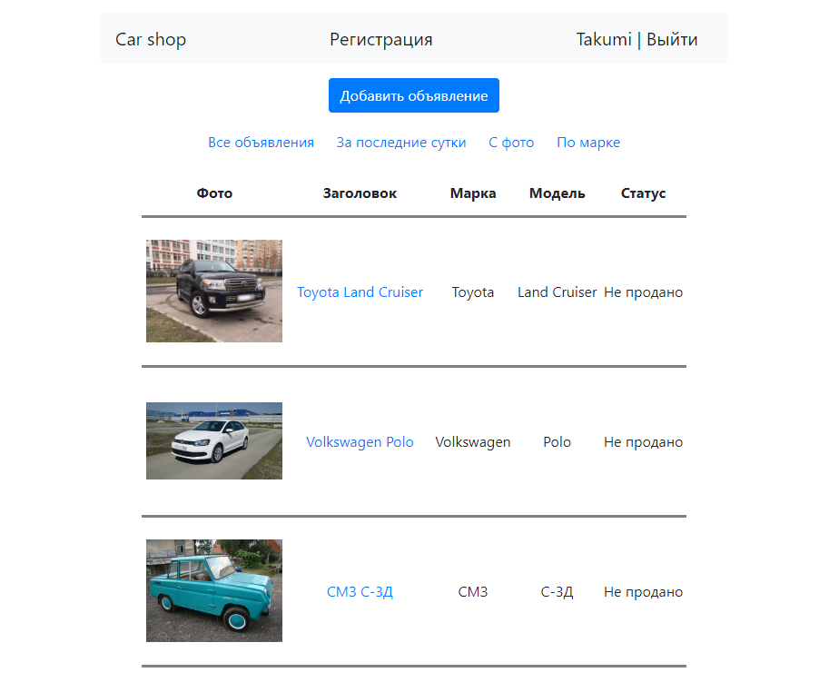
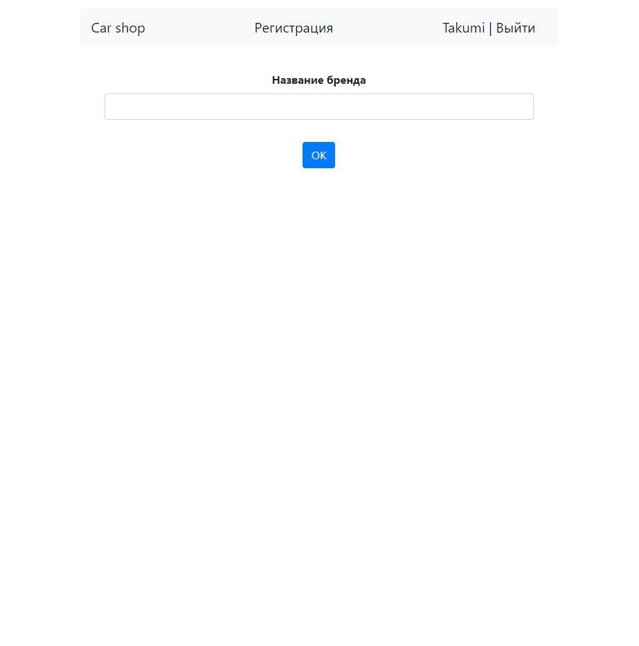
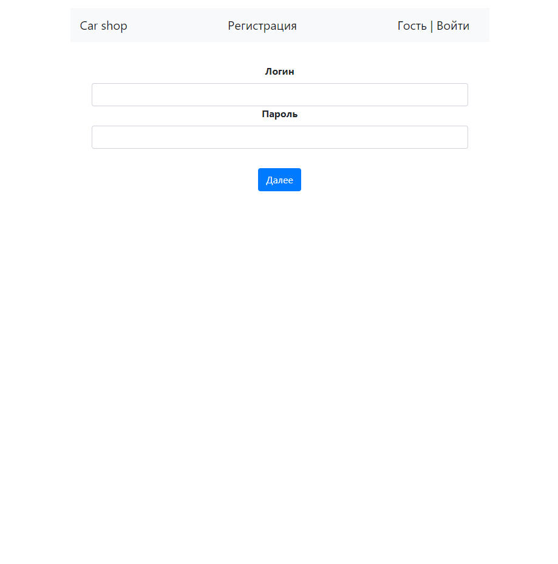
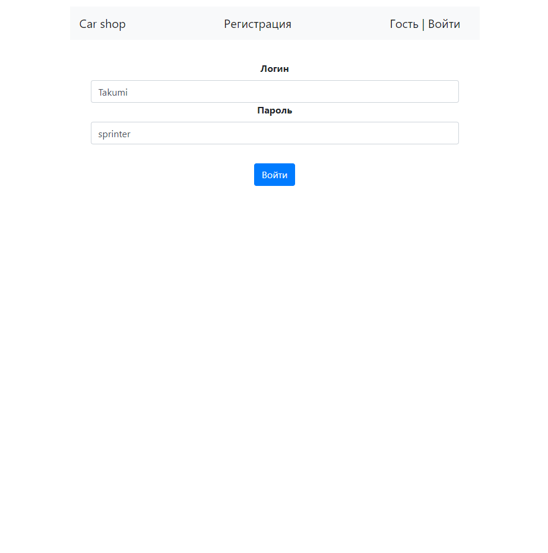
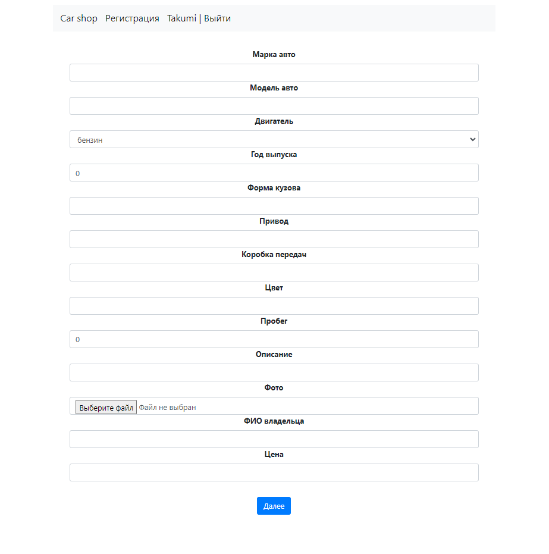

# Проект "АвтоМаг"

## Описание приложения

Приложение представляет собой сайт для покупки и продажи
подержаных и новых автомобилей.

Пользователю приложения предоставляется возможность:

1. Ознакомиться со списком всех объявлений о продаже авто;
2. Ознакомиться со списком объявлений:
- созданных за последние сутки;
- c фото;
- конкретной марки авто.
3. Просматривать каждое объявление о продаже авто;
4. Зарегистрироваться;
5. Авторизоваться;
6. Создавать объявления о продаже авто;
7. Изменять в созданных пользователем объявлениях:
- цену;
- описание;
- статус (продано/не продано).
11. Подписываться на изменения цен указанных в объявлениях;
12. Просматривать историю изменения цен указанных в объявлениях;
13. Просматривать владельцев авто.

## Используемый стек технологий

1. Java 17
2. Spring boot 2.5.2
3. Thymeleaf
4. Hibernate 5.6.11
5. Lombok 1.18.22
6. Liquibase 4.15.0
7. PostgreSQL 14

## Для запуска проекта понадобятся

1. JDK 17
2. Apache Maven 3.8.5
3. PostgreSQL 14
4. Web browser

## Запуск приложения

1. Открыть диалоговое окно комбинацией клавиш Win+R;
2. В диалоговом окне прописать cmd и нажать OK;
3. Подключиться к PostgreSQL командой ```psql --username=USER_NAME``` и ввести пароль;
4. Создать базу данных autos командой ```create database autos```;
5. Подключиться к базе данных командой ```\c autos```;
6. Выйти из терминала psql командой ```\q```;
8. Перейти в корневую папку проекта;
9. Запустить приложение командой ```mvn spring-boot:run```;
10. Перейти по ссылке http://localhost:8080/carShop в браузере.

## Интерфейс сайта

### Главная страница (все объявления)



### Поиск объявлений по марке авто



### Регистрация



### Авторизация



### Объявление о продаже авто


### Создание объявления



## Контакты

Telegram: @smith_serg

Email: kuznetsov.s.i@bk.ru

